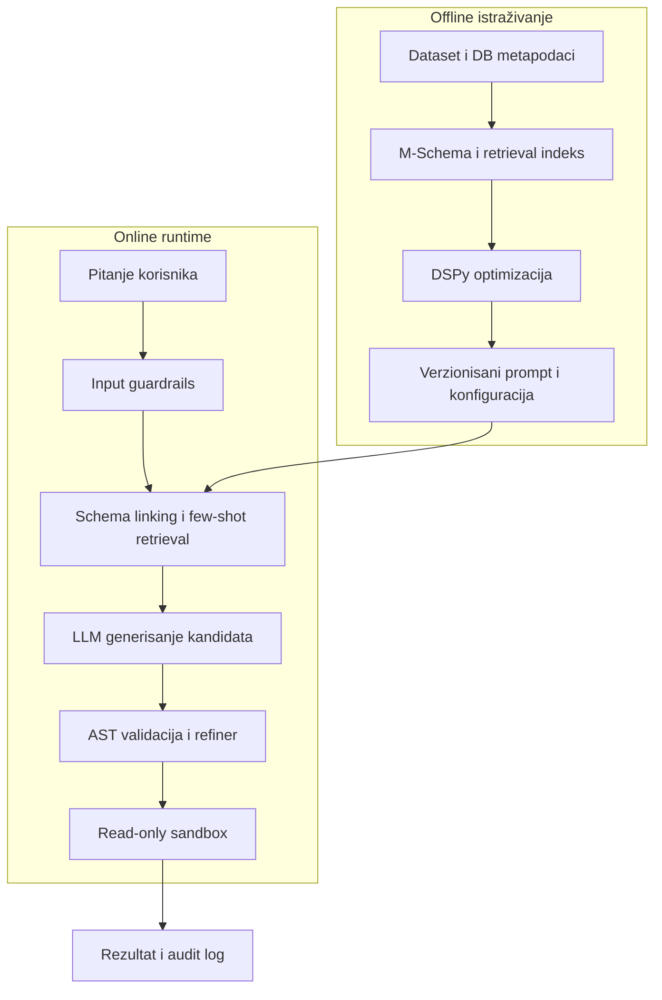

# Text-to-SQL master projekat: arhitektura i roadmap

**Tema:** Prevođenje prirodnog jezika u SQL upite korišćenjem velikih jezičkih modela
**Verzija plana:** 2.1
**Datum:** 18. avgust 2026.
**Status projekta:** Faza 1 i `LLM-002` su završeni; official Groq SDK live smoke sa `openai/gpt-oss-120b` je uspešan. Sledeći aktivni zadatak je `EXP-001` za B0/B1 development predikcije.
**Poslednja provera:** 18. avgust 2026. - 55/55 testova prolazi; EVAL-003 preflight je `ready` 31/31; Groq SDK smoke je uspešan (224 input, 124 output tokena, 697 ms)

### Istorija verzija

| Verzija | Datum | Promena |
|---|---|---|
| 1.0 | 13. avgust 2026. | Početna arhitektura, roadmap i backlog |
| 1.1 | 13. avgust 2026. | Evidentirana implementacija Faze 0, ažurirani statusi i dodat dnevnik napretka |
| 1.2 | 13. avgust 2026. | Zatvoren `SEC-000`: potvrđeno da `.env` nije verzionisan i da su ključevi i kredencijali zamenjeni |
| 1.3 | 13. avgust 2026. | Ponovo potvrđen `SEC-000`, verifikovani testovi i CLI demo, dodato uputstvo za pokretanje aktuelne Phase 0 verzije |
| 1.4 | 13. avgust 2026. | Završen `DATA-001`: zamrznut Spider2-Lite SQLite protokol, DB-disjoint split 31/104, checksumovi i automatizovana leakage validacija |
| 1.5 | 17. avgust 2026. | Završen `DATA-003`: checksum-gated Spider2-Lite metadata loader, deterministički manifest/JSONL, 31/104 runtime firewall i 14 automatizovanih testova |
| 1.6 | 17. avgust 2026. | Završen `EVAL-001`: izolovano SQLite izvršavanje, Spider2-kompatibilno poređenje, strukturirani rezultat, exact-ID coverage i 25 testova |
| 1.7 | 18. avgust 2026. | Dodat `EVAL-002` resolver/protected-reference/preflight/batch runner i 43 testa; ispravljen status Faze 1 na BLOCKED nakon resource audita pinned snapshot-a |
| 1.8 | 18. avgust 2026. | Dozvoljen paralelni offline rad na LLM-002; dodat standard-library Groq adapter i 4 offline testa; realni scoring ostaje blokiran EVAL-002 resursima |
| 1.9 | 18. avgust 2026. | Završen offline deo LLM-002: Groq CLI, audit metadata, bounded retry, aktivni model config i 49 testova |
| 2.0 | 18. avgust 2026. | Dodat primarni EVAL-003 nad official execution-result CSV-ovima; 31/31 preflight je ready i strict SQL putanja je opciona |
| 2.1 | 18. avgust 2026. | `urllib` zamenjen official Groq SDK 1.6.0 transportom; uspešan `openai/gpt-oss-120b` live smoke i 55/55 testova |

## 1. Svrha dokumenta

Ovaj dokument definiše ciljnu arhitekturu, strukturu repozitorijuma, eksperimentalni plan i roadmap projekta. Koristi se kao centralno mesto za:
- praćenje napretka implementacije;
- beleženje eksperimentalnih odluka;
- razdvajanje prototipa od reproduktivnog istraživačkog koda;
- povezivanje implementacije sa istraživačkim pitanjima master rada;
- evidentiranje rezultata, rizika i blokera.

Statusi zadataka:

- `NOT STARTED` - rad nije započet;
- `IN PROGRESS` - trenutno se radi;
- `BLOCKED` - postoji zavisnost ili problem koji sprečava nastavak;
- `DONE` - zadatak ispunjava definisani Definition of Done;
- `DEFERRED` - svesno pomeren iz trenutnog obima.

## 2. Cilj i granice projekta

### 2.1 Glavni cilj

Razviti reproduktivan i bezbedan Text-to-SQL sistem koji prima pitanje na prirodnom jeziku i metapodatke o bazi, bira relevantne delove šeme i few-shot primere, generiše SQL, proverava ga i kontrolisano ga izvršava u sandbox okruženju.

Sistem treba eksperimentalno da pokaže doprinos sledećih komponenti:

1. uključivanje šeme baze u prompt;
2. M-Schema reprezentacija;
3. preuzimanje sličnih primera;
4. DSPy optimizacija prompta;
5. extractive schema linking;
6. validacija, izbor kandidata i korekcija SQL-a;
7. bezbednosne kontrole pre izvršavanja.

### 2.2 Van osnovnog obima

Sledeće stavke nisu deo minimalno uspešnog master projekta i implementiraju se samo ako ostane dovoljno vremena:

- treniranje velikog jezičkog modela od nule;
- kompletna reprodukcija CHASE-SQL ili MAC-SQL arhitekture;
- podrška za sve Spider 2.0 dijalekte u prvoj verziji;
- automatsko izvršavanje DDL, DML i administrativnih komandi;
- produkciona autentifikacija, naplata i multi-tenant infrastruktura;
- kompleksan agent koji autonomno menja bazu ili projekat.

## 3. Istraživačka pitanja

| ID | Istraživačko pitanje | Primarne metrike |
|---|---|---|
| RQ1 | Koliko uključivanje šeme baze poboljšava uspešnost u odnosu na generisanje samo iz pitanja? | Execution Accuracy, Valid SQL Rate |
| RQ2 | Da li M-Schema i extractive schema linking poboljšavaju tačnost i smanjuju broj tokena? | Execution Accuracy, Schema Recall/F1, Input Tokens |
| RQ3 | Koliko similarity-based few-shot i DSPy optimizacija poboljšavaju statički prompt? | Execution Accuracy, cena, latencija |
| RQ4 | Koliko verifier/refiner povećava tačnost i popravlja nevalidne upite? | Repair Success Rate, Pass@k, Execution Accuracy |
| RQ5 | Koliko guardrails smanjuju uspešnost napada bez odbijanja legitimnih pitanja? | Attack Success Rate, Unsafe Query Rate, False Positive Rate |

## 4. Ciljna arhitektura

Arhitektura je podeljena na offline istraživački deo i online runtime. Offline deo priprema podatke, šeme, retrieval indeks i optimizovani prompt. Online deo koristi zamrznute artefakte i bezbedno obrađuje novo pitanje.



### 4.1 Tok jednog zahteva

1. Sistem prima pitanje, identifikator baze i SQL dijalekt.
2. Input guard proverava prazan ili predugačak unos, PII i obrasce prompt injection napada.
3. Schema linker bira relevantne tabele, kolone, ključeve i dozvoljene reprezentativne vrednosti.
4. Izabrani deo baze serijalizuje se u M-Schema format.
5. Retriever pronalazi `k` strukturno sličnih trening primera bez curenja test podataka.
6. Prompt builder kombinuje sistemsku instrukciju, dijalekt, šemu, pitanje i few-shot primere.
7. LLM provider generiše jedan ili više SQL kandidata uz sačuvane parametre generisanja.
8. SQL parser proverava sintaksu, tip operacije, tabele, kolone i bezbednosnu politiku.
9. Kandidat se probno izvršava u read-only sandboxu sa timeoutom i ograničenjem redova.
10. Ako je dozvoljeno, refiner dobija sanitizovanu grešku i pokušava ograničen broj korekcija.
11. Rezultat, latencija, tokeni, cena, odluke guardrail-a i hash konfiguracije upisuju se u audit log.

## 5. Moduli sistema

| Modul | Odgovornost | Ključni izlaz |
|---|---|---|
| Dataset loader | Učitava Spider 1.0/BIRD razvojne podatke i Spider 2.0 evaluacione zadatke | standardizovan `Example` objekat |
| Database registry | Povezuje `db_id`, dijalekt, konekciju, dokumentaciju i putanju baze | `DatabaseConfig` |
| Schema inspector | Čita tabele, kolone, tipove, PK/FK i dozvoljene vrednosti | kanonski schema model |
| M-Schema serializer | Pretvara kanonski model u stabilan tekstualni prikaz | M-Schema string |
| Schema linker | Izdvaja relevantne tabele i kolone | schema subset + score |
| Example retriever | Pronalazi top-k sličnih trening primera | lista few-shot primera |
| Prompt program | Gradi prompt i čuva verziju instrukcije | kompletan prompt |
| DSPy optimizer | Optimizuje instrukciju i demonstracije na development skupu | zamrznut DSPy program |
| LLM provider | Jedinstven interfejs prema Groq/ostalim modelima | SQL kandidati + usage |
| SQL validator | AST validacija, allowlist i provera dijalekta | odluka + razlog |
| Refiner | Ograničena korekcija kandidata na osnovu greške | popravljeni kandidat |
| Sandbox executor | Read-only izvršavanje uz timeout i limit | redovi, kolone, greška, vreme |
| Evaluator | Zvanične i dodatne metrike, bootstrap intervali | rezultat eksperimenta |
| Experiment runner | Pokreće konfiguracije nad zamrznutim skupom | JSONL/CSV rezultati |
| Gradio UI | Demonstracija finalnog pipeline-a | interaktivni demo |

## 6. Predložena struktura repozitorijuma

```text
text2sql/
├── README.md
├── pyproject.toml
├── requirements.lock
├── .env.example
├── .gitignore
├── configs/
│   ├── models.yaml
│   ├── experiments/
│   └── security_policy.yaml
├── data/
│   ├── README.md
│   ├── raw/                 # nije u Git-u
│   ├── processed/           # nije u Git-u
│   └── fixtures/            # mali test primeri mogu u Git
├── src/text2sql/
│   ├── domain/              # zajednički modeli podataka
│   ├── datasets/            # Spider/BIRD loaderi
│   ├── schema/              # introspekcija, M-Schema, linking
│   ├── retrieval/           # embedding/skeleton retrieval
│   ├── prompting/           # prompt builder i DSPy program
│   ├── providers/           # Groq i drugi LLM adapteri
│   ├── validation/          # SQL AST i security policy
│   ├── execution/           # read-only sandbox
│   ├── evaluation/          # EX, EM, bezbednost, statistika
│   └── observability/       # audit log, tokeni, cena, latencija
├── experiments/
│   ├── run.py
│   ├── baselines/
│   └── ablations/
├── notebooks/
│   ├── legacy/              # postojeći notebookovi
│   └── analysis/            # samo analiza gotovih rezultata
├── app/
│   └── gradio_app.py
├── tests/
│   ├── unit/
│   ├── integration/
│   ├── security/
│   └── fixtures/
├── artifacts/
│   ├── prompts/
│   ├── retrieval/
│   └── reports/
└── docs/
    ├── architecture.md
    ├── experiments.md
    ├── decisions.md
    └── thesis-mapping.md
```

Pravila organizacije:

- produkcioni i eksperimentalni kod živi u `src/`, ne u notebookovima;
- notebookovi samo učitavaju već generisane rezultate radi analize i grafikona;
- svaki eksperiment koristi verzionisanu YAML konfiguraciju;
- sirovi skupovi, baze, API ključevi i veliki rezultati ne ulaze u Git;
- male test baze i sintetički primeri ostaju kao fixtures;
- svaki rezultat sadrži Git commit, model ID, seed, prompt ID i dataset verziju.

## 7. Standardni modeli podataka

Minimalni interni objekti treba da budu stabilni od početka projekta:

```python
Text2SQLExample(
    example_id: str,
    db_id: str,
    question: str,
    dialect: str,
    gold_sql: str | None,
    gold_result_path: str | None,
    split: str,
    metadata: dict,
)

GenerationResult(
    example_id: str,
    experiment_id: str,
    model_id: str,
    prompt_version: str,
    generated_sql: list[str],
    selected_sql: str | None,
    validation_status: str,
    execution_status: str,
    latency_ms: int,
    input_tokens: int,
    output_tokens: int,
    estimated_cost: float | None,
    error_category: str | None,
)
```

## 8. Eksperimentalne konfiguracije

| ID | Konfiguracija | Svrha |
|---|---|---|
| B0 | Samo originalno pitanje | dokumentuje slabost pristupa bez šeme |
| B1 | Pitanje + jednostavna puna šema | meri osnovni doprinos šeme |
| B2 | Pitanje + puna M-Schema | poredi reprezentacije šeme |
| B3 | M-Schema + random few-shot | kontroliše doprinos samih demonstracija |
| B4 | M-Schema + similarity few-shot | meri doprinos retrievera |
| B5 | B4 + DSPy optimizovan program | meri automatizovanu optimizaciju prompta |
| B6 | B5 + extractive schema linking | meri fokusiranje šeme i broj tokena |
| B7 | B6 + tri kandidata + validator/refiner | meri test-time korekciju |
| S0 | B7 bez bezbednosnih kontrola, samo u izolovanom sandboxu | security baseline |
| S1 | B7 + input i output guardrails | meri zaštitu i false positive stopu |

Modeli se porede nad istim zamrznutim primerima, promptovima i parametrima. Minimalno poređenje obuhvata postojeće Llama 3.3 70B i Llama 4 Scout modele, pod uslovom da su dostupni kroz odabrani provider.

## 9. Metrike i analiza grešaka

### 9.1 Primarne metrike

- Execution Accuracy ili zvanični Spider 2.0 score;
- Valid SQL Rate;
- Unsafe Query Rate;
- Attack Success Rate;
- False Positive Rate guardrail-a.

### 9.2 Sekundarne metrike

- zvanični/strukturni Exact Match gde je dostupan;
- schema-linking precision, recall i F1;
- Pass@1 i Pass@3;
- Repair Success Rate;
- p50 i p95 latencija;
- broj ulaznih i izlaznih tokena;
- procenjena cena po tačnom odgovoru;
- veličina šeme pre i posle filtriranja.

### 9.3 Kategorije grešaka

Svaki neuspeh dobija jednu primarnu kategoriju:

1. pogrešna tabela;
2. pogrešna kolona;
3. nedostajući ili pogrešan JOIN;
4. pogrešna agregacija ili grupisanje;
5. pogrešan operator ili uslov;
6. pogrešna literalna vrednost/value grounding;
7. pogrešan SQL dijalekt;
8. sintaksna greška;
9. timeout ili neefikasan upit;
10. neispravno bezbednosno odbijanje;
11. opasan upit koji je prošao zaštitu;
12. nejasno ili višeznačno pitanje.

## 10. Bezbednosna arhitektura

LLM nikada ne predstavlja jedini bezbednosni sloj. Minimalna zaštita obuhvata:

- zaseban read-only korisnički nalog baze;
- izvršavanje samo nad izolovanom evaluacionom bazom;
- SQL AST parsiranje umesto regex validacije;
- dozvoljene operacije: jedan `SELECT` ili `WITH ... SELECT`;
- allowlist tabela i kolona iz aktivne šeme;
- zabranu sistemskih šema, DDL/DML komandi, komentara i više iskaza;
- timeout, limit redova i ograničenje resursa;
- `EXPLAIN` ili probno izvršavanje pre vraćanja rezultata;
- sanitizovane greške za refiner, bez osetljivih podataka;
- audit zapis svake odluke i pokušaja korekcije;
- adversarial testove isključivo nad sandbox bazom.

## 11. Roadmap

Procene su relativne i mogu se prilagoditi akademskom roku. Faze se ne smatraju završenim samo zato što kod radi; moraju ispuniti Definition of Done.

### Faza 0 - Stabilizacija projekta

**Trajanje:** 3-5 dana
**Status:** `DONE`

Zadaci:

- arhivirati trenutne notebookove kao legacy baseline;
- reorganizovati repozitorijum;
- uvesti `pyproject.toml`, zaključane verzije i `.env.example`;
- ispraviti `.gitignore`;
- rotirati aktivne kredencijale ako su deljeni;
- uvesti osnovne testove, logging i YAML konfiguracije.

**Definition of Done:** nova instalacija projekta uspeva jednom dokumentovanom komandom; testovi rade bez pristupa stvarnim tajnama; legacy eksperimenti su sačuvani, ali nisu deo novog pipeline-a.

### Faza 1 - Podaci i zvanična evaluacija

**Trajanje:** 1 nedelja
**Zavisnost:** Faza 0
**Status:** `DONE`

Zadaci:

- `DONE` - učitati originalne pinned metapodatke sa `db_id`; SQLite baze i šeme ostaju za evaluator okruženje;
- `DONE` - definisati razvojni skup i zaključani evaluacioni skup;
- implementirati Spider 1.0 razvojni loader tek kada počne train-only retrieval faza;
- `DONE` - implementirati Spider2-Lite SQLite metadata loader (`DATA-003`);
- `DONE` - napraviti mali fixture skup za brze testove;
- `DONE` - implementirati execution-based evaluator kompatibilan sa pinned zvaničnim Spider2-Lite comparatorom;
- `DONE` - izvršavati generated i reference SQL u odvojenim read-only in-memory kopijama iste SQLite baze;
- `DONE` - enforce-ovati exact-ID coverage pre računanja Execution Accuracy i zadržati gold SQL izvan DATA-003 metadata toka;
- `DONE` - `EVAL-003`: povezati svih šest realnih SQLite baza sa official gold-result CSV varijantama za svih 31 development primera;
- `OPTIONAL` - `EVAL-002`: zadržati protected reference-SQL runner za audit kada dodatni SQL postane dostupan.

**Definition of Done:** default CLI učitava frozen primer, pronalazi bazu, izvršava generated SQL i poredi rezultat sa svim official gold-result varijantama. Preflight potvrđuje 31/31 ID-jeva i 6/6 baza; missing reference SQL više nije blocker.

### Faza 2 - Reproduktivni baseline

**Trajanje:** 1 nedelja
**Zavisnost:** Faza 0 za provider/runner infrastrukturu; EVAL-003 za realno development bodovanje
**Status:** `IN PROGRESS`

Zadaci:

- povezati realni LLM/Groq adapter na već implementirani provider interfejs;
- ukloniti stopword/lemmatization preprocessing;
- fiksirati temperaturu, seed i parametre generisanja;
- implementirati konfiguracije B0 i B1;
- sačuvati kompletne rezultate u JSONL formatu;
- meriti EX, validnost, latenciju i tokene;
- dodati retry politiku koja ne menja semantiku eksperimenta.

**Definition of Done:** oba modela mogu da pokrenu isti zaključani skup; svaki rezultat je ponovljiv i vezan za tačnu konfiguraciju.

### Faza 3 - M-Schema i schema linking osnova

**Trajanje:** 1-2 nedelje
**Zavisnost:** Faza 2
**Status:** `NOT STARTED`

Zadaci:

- napraviti kanonski model šeme;
- implementirati ili integrisati M-Schema serializer;
- dodati podršku za PK, FK, tipove i bezbedne primere vrednosti;
- implementirati B2;
- implementirati prvi schema linker i B6 prototip;
- meriti schema recall i smanjenje broja tokena.

**Definition of Done:** za svaku bazu može se stabilno generisati ista M-Schema; postoji test da nijedan nepostojeći identifikator ne uđe u šemu; dobijeno je kontrolisano B1-B2 poređenje.

### Faza 4 - Few-shot retrieval i DSPy

**Trajanje:** 2 nedelje
**Zavisnost:** Faze 2 i 3
**Status:** `NOT STARTED`

Zadaci:

- napraviti indeks isključivo od trening primera;
- implementirati random few-shot baseline B3;
- implementirati embedding ili skeleton retrieval B4;
- dodati proveru protiv self-retrieval i test curenja;
- definisati DSPy program i execution-based metriku;
- optimizovati samo na development skupu;
- zamrznuti i verzionisati izabrani DSPy program B5.

**Definition of Done:** svaki test primer ima auditabilnu listu preuzetih primera; nijedan evaluacioni primer nije u indeksu; B3, B4 i B5 su pokrenuti nad istim skupom.

### Faza 5 - SQL validator, sandbox i refiner

**Trajanje:** 2 nedelje
**Zavisnost:** Faza 3
**Status:** `NOT STARTED`

Zadaci:

- uvesti SQL AST parser sa eksplicitnim dijalektom;
- implementirati allowlist i zabranu opasnih operacija;
- napraviti read-only sandbox executor;
- dodati timeout, row limit i sanitizovane greške;
- generisati do tri kandidata;
- implementirati deterministički izbor kandidata;
- dozvoliti najviše jednu ili dve refiner iteracije;
- implementirati B7.

**Definition of Done:** testovi potvrđuju da DDL, DML, višestruki iskazi i sistemske tabele ne mogu da se izvrše; legitimni SELECT upiti prolaze; svaki repair pokušaj je zabeležen.

### Faza 6 - Bezbednosna evaluacija

**Trajanje:** 1-2 nedelje
**Zavisnost:** Faza 5
**Status:** `NOT STARTED`

Zadaci:

- definisati threat model;
- sastaviti benigni i adversarial test skup;
- uključiti prompt-to-SQL injection, PII i pokušaje destruktivnih operacija;
- implementirati input filter i output policy;
- pokrenuti S0 i S1;
- izmeriti attack success, unsafe query i false positive stopu;
- dokumentovati poznata ograničenja zaštite.

**Definition of Done:** nijedan test ne koristi produkcionu bazu; svi napadi i očekivane odluke su verzionisani; rezultat uključuje i bezbednost i uticaj zaštite na legitimna pitanja.

### Faza 7 - Finalni eksperimenti i statistika

**Trajanje:** 2 nedelje
**Zavisnost:** Faze 1-6
**Status:** `NOT STARTED`

Zadaci:

- zaključati kod, dataset verziju i konfiguracije;
- pokrenuti sve obavezne konfiguracije;
- ponoviti stohastičke eksperimente gde je potrebno;
- izračunati bootstrap intervale pouzdanosti;
- sprovesti uparena poređenja konfiguracija;
- kategorizovati greške;
- napraviti tabele i grafikone;
- sačuvati sirove i agregirane rezultate.

**Definition of Done:** svaka tabela u radu može se ponovo generisati skriptom iz sačuvanih sirovih rezultata; zaključci odgovaraju unapred definisanim istraživačkim pitanjima.

### Faza 8 - Demo i pisanje master rada

**Trajanje:** 2-3 nedelje
**Zavisnost:** Faza 7; UI može početi ranije posle Faze 5
**Status:** `NOT STARTED`

Zadaci:

- povezati finalni pipeline sa Gradio aplikacijom;
- prikazati generisani SQL, validaciju i rezultat;
- jasno označiti odbijene upite i sandbox režim;
- ažurirati README i arhitekturu;
- napisati metodologiju, rezultate, diskusiju i pretnje validnosti;
- ispraviti faktografske i terminološke probleme iz prijave rada;
- pripremiti scenario demonstracije i odbrane.

**Definition of Done:** demo koristi isti kod kao eksperiment; rad sadrži reproduktivne konfiguracije, rezultate, analizu grešaka i ograničenja; nijedna tajna ili prava baza nije deo demonstracije.

## 12. Ključne tačke odluke

| Odluka | Rok | Podrazumevana preporuka |
|---|---|---|
| Glavni evaluacioni benchmark | DONE u `DATA-001` | pinned Spider2-Lite SQLite; custom DB-disjoint split 31 development / 104 test; nije puni leaderboard score |
| SQL dijalekt prve verzije | kraj Faze 1 | SQLite za benchmark, MySQL samo za demo ako je potrebno |
| Retriever | sredina Faze 4 | embedding retrieval kao baseline, skeleton retrieval kao proširenje |
| DSPy optimizer | početak Faze 4 | MIPROv2 sa execution-based metrikom |
| Broj kandidata | početak Faze 5 | 1 za baseline, 3 za verifier konfiguraciju |
| Broj korekcija | početak Faze 5 | najviše 1; povećati na 2 samo uz dokazanu korist |
| Spider2-Snow proširenje | posle Faze 7 | implementirati samo ako su osnovni rezultati završeni |

## 13. Registar rizika

| ID | Rizik | Verovatnoća/uticaj | Ublažavanje |
|---|---|---|---|
| R-01 | Spider 2.0 je prevelik ili zahteva cloud resurse | visoka/visok | prvo koristiti SQLite podskup i jasno navesti obim |
| R-02 | Model ID više nije dostupan kod providera | srednja/visok | provider adapter, zamenski model i evidentirana verzija |
| R-03 | DSPy optimizacija je skupa | srednja/srednji | mali development skup, budžet poziva, rani prekid |
| R-04 | Curenje test podataka kroz retrieval | srednja/visok | Spider2 test je zabranjen u retrieval-u; DB-disjoint manifest i automatski leakage test |
| R-05 | Javni Spider2 primeri su možda bili u LLM pretraining podacima | srednja/srednji | eksplicitno ograničenje u radu; test je held-out iz našeg pipeline-a, ne tvrdimo da je unseen za model |
| R-06 | Execution metric nagradi slučajno isti rezultat | srednja/srednji | više baza/test-suite evaluacija i analiza grešaka |
| R-07 | Refiner koristi osetljive DB greške | srednja/visok | sanitizovati poruke i koristiti samo sandbox |
| R-08 | Previše komponenti ugrozi rok | visoka/visok | faze i MVP granica; Spider2-Snow i kompleksni agent su opcioni |
| R-09 | API rezultati nisu deterministički | visoka/srednji | temperatura 0, seed gde postoji, više ponavljanja i sačuvani izlazi |

## 14. Tracker zadataka

Ova tabela predstavlja aktivni backlog i ažurira se pri svakom značajnom radu na projektu.

**Sažetak stanja:** 12 zadataka je završeno; `EVAL-003` i `LLM-002` su `DONE`. Development evaluator ima svih 31 gold rezultata i 6 baza, a official SDK live smoke je uspešan; `EXP-001` je sledeći prioritet.
| Task ID | Zadatak | Faza | Prioritet | Status | Zavisnost | Dokaz završetka |
|---|---|---:|---|---|---|---|
| PLAN-001 | Arhitektura i roadmap | 0 | P0 | DONE | - | ovaj dokument |
| REPO-001 | Kreirati novu strukturu repozitorijuma | 0 | P0 | DONE | PLAN-001 | `text2sql/` struktura i 5 testova |
| REPO-002 | Zaključati zavisnosti i dodati `.env.example` | 0 | P0 | DONE | REPO-001 | offline editable instalacija prolazi; Phase 0 nema runtime zavisnosti |
| REPO-003 | Premestiti stare notebookove u legacy | 0 | P1 | DONE | REPO-001 | `notebooks/legacy/` sa notebookovima i starim demo kodom |
| SEC-000 | Rotirati ranije korišćene API ključeve/DB lozinke pre javnog commita | 0 | P0 | DONE | - | korisnik potvrdio da `.env` nikad nije verzionisan i da su ključevi i kredencijali zamenjeni |
| DATA-001 | Izabrati i dokumentovati benchmark/split | 1 | P0 | DONE | REPO-001 | pinned TOML protokol, split manifest 31/104, ADR-003 i 3 leakage/protocol testa |
| DATA-002 | Implementirati standardni `Text2SQLExample` | 1 | P0 | DONE | REPO-001 | `domain/models.py` i unit test |
| DATA-003 | Implementirati loader za pinned Spider2-Lite SQLite 135 metadata/ID-jeve | 1 | P0 | DONE | DATA-001, DATA-002 | checksum pre parsiranja, metadata manifest, normalizovani hash `9951e147...b6c9f0`, 6 loader testova |
| EVAL-001 | Implementirati execution evaluator | 1 | P0 | DONE | DATA-003 | izolovano SQLite izvršavanje, pinned-kompatibilni comparator, strukturirani rezultat, exact-ID coverage i 11 evaluator testova |
| EVAL-002 | Strict reference-SQL Spider2-Lite runner | 1 | P1 | OPTIONAL | DATA-003, EVAL-001 | SQL audit putanja je očuvana; 30/31 reference SQL fajlova nije javno dostupno i nije potrebno za glavno bodovanje |
| EVAL-003 | Official gold-result Spider2-Lite runner | 1 | P0 | DONE | DATA-003, EVAL-001 | svih 31 development ID-jeva i 6 baza prolaze preflight; CSV varijante, checksum manifest, default CLI i 5 novih testova |
| LLM-001 | Implementirati provider interfejs | 2 | P0 | DONE | REPO-002 | provider protokol, deterministički mock i test pipeline-a |
| LLM-002 | Implementirati realni LLM/Groq adapter | 2 | P0 | DONE | LLM-001 | official Groq SDK 1.6.0, bounded retry, audit metadata, 7 offline testova i uspešan `openai/gpt-oss-120b` live smoke |
| EXP-001 | Implementirati B0 i B1 | 2 | P0 | NOT STARTED | LLM-002, EVAL-003 | svi infrastrukturni uslovi su spremni; slede generisanje i scoring 31 development predikcije |
| SCHEMA-001 | Implementirati kanonski model šeme | 3 | P0 | NOT STARTED | DATA-003 | unit test |
| SCHEMA-002 | Implementirati M-Schema | 3 | P0 | NOT STARTED | SCHEMA-001 | B2 rezultat |
| RET-001 | Napraviti train-only retrieval indeks | 4 | P0 | NOT STARTED | DATA-001 | leakage test |
| RET-002 | Implementirati random i similarity few-shot | 4 | P0 | NOT STARTED | RET-001 | B3/B4 rezultat |
| DSPY-001 | Definisati i optimizovati DSPy program | 4 | P1 | NOT STARTED | RET-002, EVAL-001 | zamrznut B5 artefakt |
| LINK-001 | Implementirati extractive schema linking | 4 | P1 | NOT STARTED | SCHEMA-002 | B6 rezultat i schema recall |
| SAFE-001 | Implementirati SQL AST validator | 5 | P0 | NOT STARTED | SCHEMA-001 | security unit testovi |
| SAFE-002 | Implementirati read-only sandbox executor | 5 | P0 | NOT STARTED | SAFE-001 | integration test |
| REF-001 | Implementirati izbor kandidata i refiner | 5 | P1 | NOT STARTED | SAFE-002 | B7 rezultat |
| SEC-001 | Definisati threat model i adversarial skup | 6 | P0 | NOT STARTED | SAFE-002 | verzionisan test skup |
| SEC-002 | Implementirati i evaluirati guardrails | 6 | P0 | NOT STARTED | SEC-001 | S0/S1 rezultati |
| RUN-001 | Zamrznuti finalne konfiguracije | 7 | P0 | NOT STARTED | sve obavezne faze | release tag/commit |
| RUN-002 | Pokrenuti finalne eksperimente | 7 | P0 | NOT STARTED | RUN-001 | sirovi rezultati |
| ANALYSIS-001 | Statistika, grafikoni i analiza grešaka | 7 | P0 | NOT STARTED | RUN-002 | generisani izveštaji |
| APP-001 | Povezati finalni pipeline sa Gradio UI | 8 | P1 | NOT STARTED | SAFE-002 | demo scenario prolazi |
| THESIS-001 | Ažurirati metodologiju i teorijski deo | 8 | P0 | NOT STARTED | DATA-001 | pregledana poglavlja |
| THESIS-002 | Napisati rezultate, diskusiju i ograničenja | 8 | P0 | NOT STARTED | ANALYSIS-001 | finalna poglavlja |

## 15. Pravila praćenja napretka

### 15.1 Nedeljni update

Na kraju svake nedelje dodati zapis sledećeg oblika:

```text
Nedelja / datum:
Završeno:
- TASK-ID: kratak rezultat

U toku:
- TASK-ID: trenutno stanje

Blokirano:
- TASK-ID: uzrok i potrebna odluka

Rezultati:
- eksperiment, metrika, putanja do artefakta

Odluke:
- šta je odlučeno i zašto

Plan za sledeću nedelju:
- najviše 3 glavna cilja
```

### 15.2 Evidencija odluka

Svaka metodološki važna odluka ulazi u `docs/decisions.md`:

| Polje | Sadržaj |
|---|---|
| Decision ID | npr. ADR-001 |
| Datum | datum odluke |
| Problem | šta je trebalo odlučiti |
| Opcije | razmatrane alternative |
| Odluka | izabrano rešenje |
| Razlog | metodološko i praktično obrazloženje |
| Posledice | uticaj na eksperimente i rad |

### 15.3 Kada se task može označiti kao DONE

Task je `DONE` samo ako:

- kod ili dokumentacija postoje na dogovorenom mestu;
- postoji test ili drugi proverljiv dokaz;
- konfiguracija i ulazi su evidentirani;
- nema tajni ili produkcionih podataka u repozitorijumu;
- rezultat može da ponovi druga osoba prema README-u;
- promena je povezana sa odgovarajućim istraživačkim pitanjem.

## 16. Prvi sprint

**Status sprinta:** `DONE` - infrastrukturni cilj i odluka `DATA-001` su završeni.

Prvi sprint treba da traje najviše jednu nedelju i da se završi pre razvoja M-Schema ili DSPy dela.

### Cilj sprinta

Dobiti čistu, instalabilnu osnovu projekta i jedan mali end-to-end eksperiment koji čuva rezultat, bez oslanjanja na stanje Jupyter kernela.

### Obavezni zadaci i stanje

1. `DONE` - `REPO-001`: nova struktura repozitorijuma;
2. `DONE` - `REPO-002`: zavisnosti, `.env.example` i ispravljen `.gitignore`;
3. `DONE` - `REPO-003`: arhiviranje trenutnih notebookova;
4. `DONE` - `DATA-001`: Spider2-Lite SQLite protokol, DB-disjoint split i leakage pravila;
5. `DONE` - `DATA-002`: standardni model jednog primera;
6. `DONE` - mali fixture dataset i SQLite baza;
7. `DONE` - minimalni CLI: pitanje + šema -> mock model -> SQL -> JSONL zapis;
8. `DONE` - testovi bez pozivanja plaćenog API-ja (8/8 prolazi).

### Rezultat sprinta

- projekat se instalira iz praznog okruženja;
- jedan fixture primer prolazi kroz ceo pipeline;
- rezultat sadrži model, prompt, SQL, status, latenciju i tokene;
- postojeći notebookovi više nisu izvor produkcionog koda;
- spremna je osnova za Fazu 1 i zvanični evaluator.

## 17. MVP i prošireni cilj

### Minimalno uspešan master projekat

MVP obuhvata faze 0-3, osnovni retrieval iz Faze 4, AST/sandbox iz Faze 5, ograničenu bezbednosnu evaluaciju i finalne eksperimente. Mora sadržati najmanje B0, B1, B2, B4, B6 i S1 konfiguracije.

### Poželjni prošireni cilj

Proširena verzija dodaje DSPy B5, tri kandidata i refiner B7, detaljan adversarial generator i eventualnu Spider2-Snow evaluaciju.

Ako rok postane kritičan, prvo se odlažu Spider2-Snow, kompleksni multi-agent pristup i dodatni modeli. Ne odlažu se zvanična evaluacija, sprečavanje data leakage-a, reproduktivnost i read-only sandbox.

## 18. Dnevnik napretka

### 2026-08-13 - Završena implementacija Faze 0

Završeno:

- `REPO-001`: kreirana nova `text2sql/` struktura sa kodom izdvojenim iz notebookova;
- `REPO-002`: dodat je `pyproject.toml`, Phase 0 lock bez runtime zavisnosti, `.env.example`, bezbedan `.gitignore` i verzionisane YAML konfiguracije;
- `REPO-003`: oba originalna notebooka, stari `app.py` i generator sintetičkog CSV-a sačuvani su u `notebooks/legacy/`;
- `DATA-002`: implementirani su stabilni domenski modeli, uključujući `Text2SQLExample` i `GenerationResult`;
- `LLM-001`: završen je provider interfejs i deterministički mock; realni adapter je izdvojen u novi zadatak `LLM-002`;
- implementirani su read-only SQLite schema inspector, jednostavni serializer šeme, baseline prompt, provider protokol, deterministički mock provider, CLI i JSONL audit zapis;
- dodati su fixture šema, fixture primeri i skripta za kreiranje demo baze;
- svih 5 unit/integration testova prolazi;
- prolaze kompilacija, offline editable instalacija i CLI smoke run bez API ključa;
- potvrđeno je da Phase 0 ne izvršava generisani SQL;
- `SEC-000`: potvrđeno je da stari `.env` nikad nije dodat u repozitorijum i da su raniji ključevi i kredencijali zamenjeni;
- ponovljena provera nakon rotacije tajni: svih 5 testova i kompletan CLI demo prolaze.

Odluke:

- realni Groq/LLM adapter ostaje za Fazu 2;
- zvanični B0/B1 eksperimenti neće početi pre Faze 1 i execution-based evaluatora;
- trenutni mock rezultat je infrastrukturna provera i ne predstavlja rezultat master rada.

### 2026-08-13 - Završen DATA-001

- Spider2-Lite je zamrznut na commit `cafb867313aab4e674652054198f383cf4018943` sa checksumovima;
- 135 SQLite primera podeljeno je po bazama na 31 development i 104 test primera;
- test skup i gold SQL su zabranjeni u retrieval-u, prompt optimizaciji i DSPy toku;
- `oracle tables` je isključen iz primarnog protokola;
- dodati su TOML protokol, JSON manifest, ADR-003, dokumentacija i validator;
- 8/8 testova prolazi.

Sledeće:

1. `EVAL-001`: implementirati official execution-result comparator wrapper;
2. `LLM-002`: povezati realni Groq adapter tek nakon evaluatora.

### 2026-08-17 - Završen DATA-003

- implementiran je checksum-gated Spider2-Lite loader koji pre parsiranja proverava pinned JSONL;
- potvrđeni su 547 upstream zapisa i platform totals 205 BigQuery / 207 Snowflake / 135 SQLite;
- izdvojeno je tačno 135 SQLite primera uz runtime DB firewall 31 development / 104 test;
- normalizovani metadata JSONL ne sadrži gold SQL, a gold-like polja se eksplicitno odbijaju;
- dodat je verzionisani dataset manifest i CLI `text2sql-prepare-spider2`;
- normalizovani `examples.jsonl` ima SHA-256 `9951e147543c819597dec0336c486612171e36c73ddc5b7e8b387e6f20b6c9f0`;
- ažurirani su ADR-004, dokumentacija i registar izvora;
- 14/14 testova i puni pinned metadata CLI prolaze bez tajni i mrežnih servisa;
- Groq, M-Schema, retrieval i DSPy nisu menjani.

Sledeće:

1. `LLM-002`: implementirati realni Groq adapter preko postojećeg provider interfejsa;
2. `EXP-001`: povezati reproducibilne B0/B1 eksperimente tek nakon `LLM-002`.

### 2026-08-17 - Završen EVAL-001

- dodat je `SQLiteQueryExecutor` koji source bazu otvara read-only, kopira je u memoriju i svaki SQL izvršava u zasebnoj konekciji sa timeout-om;
- generated i reference SQL se izvršavaju nezavisno nad istom snapshot bazom, bez izmene izvornog fajla;
- comparator prati pinned Spider2-Lite pravila za kolonske vektore, `condition_cols`, `ignore_order`, apsolutnu numeričku toleranciju `1e-2` i NULL/NaN normalizaciju;
- rezultat evaluacije strukturirano beleži status, score, redove, kolone, trajanje, podešavanja poređenja i greške;
- `summarize_execution_accuracy` odbija duplikate, nedostajuće i dodatne ID-jeve pre računanja `correct / total`;
- dodat je `text2sql-evaluate` CLI i dokument `docs/evaluation.md`;
- testovi pokrivaju identične i različite rezultate, redosled, execution error, prazan rezultat, NULL, numeriku, `condition_cols`, nepromenjivost fixture baze i exact coverage;
- svih 25/25 testova prolazi; Groq, M-Schema, retrieval, DSPy, schema linking i security guardrails nisu menjani.

Dodati fajlovi:

- `src/text2sql/evaluation/__init__.py`;
- `src/text2sql/evaluation/models.py`;
- `src/text2sql/evaluation/sqlite_executor.py`;
- `src/text2sql/evaluation/comparator.py`;
- `src/text2sql/evaluation/evaluator.py`;
- `src/text2sql/evaluation/cli.py`;
- `tests/test_execution_evaluator.py`;
- `docs/evaluation.md`.

Izmenjeni fajlovi:

- `pyproject.toml`;
- `requirements.lock`;
- `README.md`;
- `docs/experiments.md`;
- `docs/decisions.md`;
- `docs/thesis-mapping.md`;
- `docs/project-plan-roadmap.md`;
- `docs/sources-and-references.md`.

Sledeće:

1. `EXP-001`: generisati i bodovati B0/B1 predikcije kroz spremni EVAL-003 runner;
2. `SCHEMA-001`: nakon baseline-a implementirati kanonski model šeme.

### 2026-08-18 - Implementiran EVAL-002 kod; task blokiran resursima

Implementirano:

- deterministički `db_id -> <db_id>.sqlite` resolver bez fallback-a, sa strukturiranim greškama i SHA-256;
- evaluation-only `ProtectedReferenceSQLStore`, odvojen od DATA-003 i model pipeline-a;
- podrška za official `condition_cols` i `ignore_order` metadata, uključujući više condition-column varijanti;
- `Spider2EvaluationRunner` koji povezuje DATA-003, resolver, protected SQL i EVAL-001;
- strict duplicate/missing/extra coverage za predikcije, DATA-003 ID-jeve i reference SQL;
- batch sa total/evaluated/correct/incorrect/execution-errors/Execution Accuracy poljima;
- single-example i development-split CLI `text2sql-evaluate-spider2`;
- 18 novih testova; kompletan suite je 43/43.

Resource audit pinned commit-a:

- official evaluation metadata i execution-result CSV pokrivaju svih 31 development ID-jeva;
- javni pinned `gold/sql` pokriva samo `local309`, pa nedostaje 30 reference SQL fajlova;
- official SQLite arhiv je preuzet iz pinned README-a; svih šest potrebnih baza je instalirano i hashovano;
- potrebno je šest baza: `Airlines`, `city_legislation`, `electronic_sales`, `f1`, `music`, `oracle_sql`.

Dodati fajlovi:

- `src/text2sql/evaluation/resources.py`;
- `src/text2sql/evaluation/spider2_runner.py`;
- `src/text2sql/evaluation/spider2_cli.py`;
- `tests/test_spider2_evaluation_runner.py`;
- `docs/spider2-evaluation-runner.md`.

Izmenjeni fajlovi:

- `src/text2sql/evaluation/__init__.py`;
- `pyproject.toml`;
- `README.md`;
- `data/README.md`;
- `docs/decisions.md`;
- `docs/project-plan-roadmap.md`;
- `docs/sources-and-references.md`.

Blokirano:

- strict SQL `EVAL-002` ostaje opciono nepotpun, ali više ne blokira projekat; SQL-free `EVAL-003` je primarna evaluaciona putanja;
- benchmark scoring više nije blokiran SQL ili provider resursima; sledeći korak je `EXP-001`.

Lokalna provera implementacije:

```bash
PYTHONPATH=src python3 -m unittest discover -s tests -v
python3 -m compileall -q src tests
```

Kompletna realna CLI komanda i očekivana lokalna struktura su u
`docs/spider2-evaluation-runner.md`.

### 2026-08-18 - Završen offline deo LLM-002; live smoke blokiran

Implementirano:

- eksplicitni izbor `mock` ili `groq` providera kroz generation CLI;
- obavezni model ID za Groq, sa temperaturom i maksimalnim brojem tokena;
- aktivni kandidat `openai/gpt-oss-120b`; deprecated Llama 3.3 ID ostaje samo kao provenance zapis;
- audit metadata za provider request ID, vraćeni model, endpoint i parametre generisanja;
- najviše dva retry pokušaja sa determinističkim backoff-om za transport greške;
- mocked CLI integracioni test i retry test; kompletan suite je 49/49.

Blokirano:

- autorizovani `openai/gpt-oss-120b` smoke je pokrenut sa 1024 output token limita, ali je Groq edge vratio HTTP 403/1010;
- zahtev nije automatski ponovljen; evaluator je nezavisno spreman i ovaj pokušaj nije benchmark rezultat.

### 2026-08-18 - Završen EVAL-003 bez nedostajućih SQL fajlova

Implementirano:

- official gold-result CSV store sa više varijanti, pinned comparison metadata i SHA-256 zapisima;
- generated SQL se izvršava jednom, zatim se rezultat poredi sa svakom validnom official varijantom;
- default `text2sql-evaluate-spider2` CLI koristi `gold-result`; strict `reference-sql` režim ostaje eksplicitan i opcion;
- realni development preflight: 31/31 primera, 6/6 baza, 0 missing gold rezultata, `ready: true`;
- EVAL-003 ima 5 novih testova; nakon SDK transport testa kompletan suite je 55/55.

### 2026-08-18 - Završen LLM-002

- `urllib` transport je zamenjen official `groq==1.6.0` SDK transportom;
- SDK interni retry je isključen; projektni bounded retry ostaje jedina retry politika;
- ispravljen je SDK base URL i dodat regression test;
- live `openai/gpt-oss-120b` smoke je uspešan: validan SQL, 224 input tokena, 124 output tokena i 697 ms;
- rezultat je sačuvan u `artifacts/reports/groq-sdk-smoke.jsonl`; smoke potvrđuje infrastrukturu, ne benchmark kvalitet;
- kompletan offline suite je 55/55.
